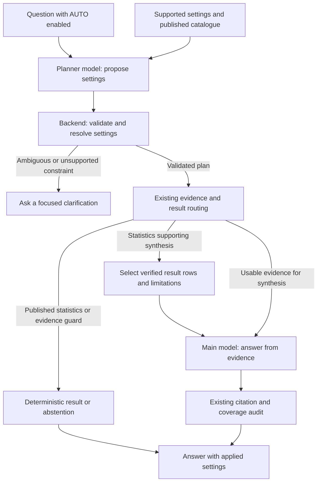

# AUTO chat settings implementation plan

Status: implemented on `auto-setting`, deployed and verified on 2026-10-09 JST.
AUTO remains opt-in per account.
Prepared: 2026-10-08 JST.
Original plan reviewed at `794221d`; implementation rebased on latest `main` at `aa53bd7`.

## Implemented scope and remaining evaluation

The initial implementation adds the toolbar toggle, `settings_mode` request
contract, sequential structured planner calls for Ollama/Vertex, validated
source/filter proposals, a versioned descriptions/availability catalogue, and
history records containing requested and effective settings. It preserves main
model generation preferences. AUTO failures and clarification requests return
without evidence retrieval or answer generation. Editing applied controls copies
the effective values into manual settings; turning AUTO off restores the saved
manual snapshot. Late responses cannot cross account boundaries.

Supported routes are ordinary scoped RAG, exact published workflows,
`published_synthesis` with bounded complete result-row packets, and deterministic
`sst_coverage` from the existing verified calendar ledger. Exact and synthesis
share the same result selector; manual exact-alias behavior is retained. Packets
retain cohort/protocol identities, units, denominators, publication limitations,
and result IDs; prompt omissions remain in existing diagnostics. Synthesis does
not receive the deterministic-answer scientific-claim verification label.

Latest `main` already supplies `SatelliteFilters.dataset_id`, the MUR dataset
selector, and operationally accepted schema-v3 Miyagi analyses. These are reused;
this branch does not publish data or confer researcher/provider endorsement.
The repository's existing deployment branch is `gcp-dev`.

Remaining work includes mixed raw/published `hybrid` routing, a reviewed geographic
resolver, richer catalogue/protocol phrase matching, and live planner evaluation
on English/Japanese questions and unsupported qualifiers. The backend checks
schema, allowlisted choices, pins, quoted filter constraints, explicit dates,
required sources, publication status and fixed-panel scope. It cannot prove that
the model recognized every natural-language qualifier. Unpinned ambiguous
publications/cohorts require an explicit choice. The user subsequently authorized
the first eligible published assay as the default when no protocol is requested;
explicit assay requirements and pins still take priority. Same-publication Miyagi
method variants have a bounded verified 3NN default. No real model or cloud calls
were made during offline tests. Subsequent cloud builds and bounded live Vertex
preflights are recorded in [the deployment record](AUTO_CHAT_SETTINGS_DEPLOYMENT_2026-10-09.md).
Final immutable-image acceptance passed fresh and pinned Miyagi workflows,
published interpretation, CTD RAG and rejected incompatible qualifiers. Broader
planner evaluation remains outstanding. AUTO is not enabled by default for a user.

Server configuration: `AUTO_SETTINGS_ENABLED` (default `true`),
`CHAT_PLANNER_MODEL` (defaults to `CHAT_MODEL`),
`CHAT_PLANNER_TIMEOUT_SECONDS` (default 30, maximum 120), and
`CHAT_PLANNER_MAX_OUTPUT_TOKENS` (default 1600, maximum 4096).
The server can disable AUTO without invalidating saved manual preferences.

The sections below retain the broader target design and acceptance criteria;
they include work beyond this initial implementation.

### Validation and branch housekeeping

Deployment preparation exposed and corrected oversized production catalogues,
provider schema complexity, omitted confirmed pins, literal calendar ranges and
fresh published defaults. Latest application source is `49950fb` (planner v6).
The final cloud build passed lint, generated-scope freshness, 1,337 backend tests
(49 optional skips), container/database gates and reviewed scans. All 79 frontend
tests and TypeScript passed, including mounted selection controls. Eight real
answer paths, three rejected constraints and manual all-off abstention passed
on the immutable image before promotion. Production serves
`ocean-platform-auto-settings1009e`; backup, post-promotion preservation and auth
checks passed. Previous AUTO and v0.7.5 revisions remain for rollback. See the
[fresh-selection correction record](AUTO_CHAT_SETTINGS_FRESH_SELECTION_FIX_2026-10-09.md)
and [initial rollout record](AUTO_CHAT_SETTINGS_DEPLOYMENT_2026-10-09.md).

Offline validation: the full backend run passed 1,298 tests with 39 optional
PostgreSQL integration tests skipped, at 80.5% coverage. A final focused run after
the ambiguity/stale-publication checks passed 57 planner/runtime/research tests. All 78 frontend
tests passed, including mounted AUTO/manual transitions and late-response account
isolation. Lint, generated-scope freshness, TypeScript and production build were
checked. Providers were mocked; PostgreSQL integration and live planner quality
were not evaluated here. Full backend tests required localhost fixture servers
outside the filesystem/network sandbox.

The new branch starts from updated `main`; `gcp-dev` is retained. Nine obsolete
fully merged branches were deleted locally and remotely after a verified backup.
The backup is `.git/branch-archive/before-auto-setting-20261008.bundle`.
Automatic approval review initially rejected deletion of unmerged shared branches.
Following explicit user approval on 2026-10-09, the following six remaining local
branches and their five remote counterparts were deleted after checking that all
tips matched the verified backup:

- `codex/issue-103-historical-sst`
- `codex/overview-gcp-patch`
- `codex/overview-temporal-coverage` (local only)
- `codex/v0.7.3-operations-docs`
- `codex/v0.7.3-release`
- `codex/v075-docs-issue-audit` (fully merged; its other clean worktree was detached)

The detached worktree retains its existing commit and files. Only `main`,
`gcp-dev` and `auto-setting` remain as branches locally and on origin. The bundle
preserves the deleted branch histories, including commits not reachable from
`main`, for recovery.

## Product behavior

Add an `AUTO` toggle beside `Select all` and `Clear selection` in the chat
Evidence sources section. When enabled, submitting a question automatically
selects the relevant data families, supported filters, and analysis context
before producing the answer. The user sees a short explanation of the applied
settings with the answer and can edit those settings for a subsequent request.

Use two model roles in sequence:

The main model depends on the validated plan, so these calls are sequential.
They can use separately configured model IDs through the existing runtime;
two application services or two permanently running local models are not required.
Existing exact-result paths may use the planner without invoking the main model.
Published results can also become validated evidence for the main model when
the question asks for interpretation or a broader synthesis.

## Findings from the current code

| Area | Existing implementation | Consequence for AUTO |
| --- | --- | --- |
| Source controls | `frontend/components/ChatSourceSettings.tsx` renders the two buttons and four source panels. | Add the toggle here. |
| Submission | `frontend/app/chat/page.tsx:runQuestion` sends the current scope and settings to `/chat`. | Add the mode to this request and render the effective plan returned by the backend. |
| Preferences | `frontend/lib/chat-settings.ts` and `use-chat-settings.ts` validate and save settings per account. Published analysis IDs remain transient. | Persist the mode, keeping automatically generated scopes separate from saved manual preferences. |
| Scope contract | `retrieval/source_scope.py:EvidenceScope` defines independent filters for each family; the frontend contract is generated by `scripts/export_chat_scope.py`. | Reuse this validation and export process rather than defining another source/filter schema. |
| Backend | `api/main.py:chat` resolves published analysis selection before retrieval and generation. | Resolve AUTO before analysis selection and before any evidence operation. |
| Retrieval | `orchestration/unified.py:retrieve_with_expansion` and `retrieval/source_aware.py` retrieve per source and reconcile supplied coverage. | Send the validated scope into these existing paths. |
| Partial automation | `infer_expected_source_types` uses keywords for diagnostics, while analysis/reliability context also uses keyword triggers. | Merely setting checkboxes or `inject_analysis=true` does not provide semantic routing for arbitrary wording. |
| Published options | `/chat/filter-options` supplies searchable facets; `/chat/analysis-options` supplies published IDs, status, protocols and workflows. | Reuse the underlying services to ground choices. Filter facets are capped at 100 values; truncation is not proof that a value is absent. |
| Exact answers | `orchestration/edna_aggregation.py` and `research_intents.py` handle catalogue counts and six published workflows conservatively. | Keep exact statistics and cohort validation in those handlers. |
| Runtime | `model_runtime.py` supports Ollama and Vertex with a text chat interface. | Add a bounded structured planning call; the current chat method does not expose a JSON schema output contract. |
| Traceability | `api/chat_records.py` stores JSON request options and evidence snapshots. | Store the plan and its effective settings with the existing interaction. |

This proposal targets the active Next.js/FastAPI code, not the archived Streamlit UI.

## Scope of automatic settings

| Setting | Proposed behavior |
| --- | --- |
| CTD, Metagenome, Satellite SST, ANEMONE eDNA | Planner proposes required families; backend checks the intent and catalogue. |
| Dates, bay, station, sample, taxon, provider/project/run | Apply explicit question constraints after normalization and validation against the applicable source. |
| Coordinates | Accept explicit coordinates or a supported, reviewed geographic resolver result. Never invent a bounding box. |
| SST product/collection | Resolve a published collection by verified product/version, area, date range and final/interim generation; retain an explicit selection for coverage and compatible research workflows. |
| Analysis and reliability context | Planner selects supported topics; backend selects eligible context documents under the same source scope. |
| Cross-source expansion | Use a bounded backend preset for comparison or synthesis questions. |
| Retrieval count and weights | Planner chooses a named preset; backend maps it to validated values. Start with existing defaults until evaluation justifies changes. |
| Published analysis and assay protocol | Describe available capabilities to the planner; honor explicit selections and allow unique verified matches through the published-result service. |
| Answer model and generation parameters | Preserve the configured/user-selected main model and current generation preferences in the first release. |
| Citation audit | Keep enabled for AUTO. |

Suggested presets are `measurement`, `synthesis`, and `comparison`. For the
initial implementation all can retain `k=8`, vector/FTS weights `0.6/0.4` and
RRF-k `60`. Context and expansion differ by intent; avoid claiming that a model
can optimize arbitrary numerical settings without evaluation.

Important source distinctions:

- CTD/metagenome accept bay codes `O`, `I`, `M`; SST/eDNA accept coordinate filters
  instead. A bay constraint cannot simply be copied into every selected family.
- `config.py` contains an SST acquisition region and a monitoring point;
  `schema/anchor_event.py` contains approximate bay coordinates. These are not
  reviewed bay boundaries. Add a resolver with recorded meaning/extent before
  converting a named bay into SST/eDNA geographic filters. Until then, ask for
  a supported area or coordinates when that constraint must apply there.
- Distinguish fish eDNA from shotgun metagenome diversity. A bare question about
  “diversity” can require clarification when the intended dataset is unclear.
- Keep assignment methods and assay protocols distinct. Environmental-only
  questions retain the existing exclusion of unknown/control classifications.
- Do not introduce dates, taxon substitutions, protocol IDs, or ecological
  exclusions merely because they would make retrieval return more results.

## Backend design

### One authoritative submission

Extend `ChatRequest` with `settings_mode: Literal['manual', 'auto'] = 'manual'`.
For AUTO, require the versioned `evidence_scope` envelope and reject mixed legacy
scope fields. Its unpinned values are the manual snapshot, not the effective
AUTO scope. Explicit transient analysis selections remain constraints.

Run planning once inside `/chat`, before `selection_id`, `research_mode`,
`_resolve_analysis_request`, aggregate routing or retrieval are computed.
Keep planning, catalogue access, and validation in a service module, proposed
as `orchestration/settings_planner.py`, with schemas in
`orchestration/settings_plan.py`.

Separate the original request from the effective `ChatRequest`. Assemble the
latter only from validated planner fields plus generation preferences, and
validate it again with the current request/scope models. Do not pass the raw
planner response into retrieval options or SQL.

An initial planner proposal should contain:

- Plan version and a bounded intent/topic enum.
- Proposed source families and explicit constraints, with references to the
  question text supporting each constraint.
- A named retrieval preset and analysis/reliability topics.
- Required source families and a comparison kind, where applicable.
- An answer route (`rag`, `published_exact`, `published_synthesis`, or `hybrid`)
  and bounded published-result requests when applicable.
- A short user-facing explanation or a focused clarification request.

The backend-produced effective plan additionally contains the canonical scope,
actual applied options, accepted/rejected constraints, validation status,
planner model/version and timing. Quote references improve traceability but
do not replace semantic validation. Do not use self-reported LLM confidence
as the sole decision to apply settings.

### Catalogue grounding and validation

Give the planner a bounded description of the four sources, allowed settings,
supported topics and relevant published choices. Use read-only catalogue services
directly, with targeted facet lookups for candidate identifiers rather than
sending the entire sample/taxon catalogue in the prompt.

Require one strict JSON object with forbidden extra fields, bounded output
lengths and bounded lists. Reject executable instructions, generated SQL,
invented IDs, unsupported fields, invalid dates and conflicting filters.
A requested value that has no matching records remains an unmet constraint;
do not drop it or substitute the nearest available value.

The planner handles interpretation; deterministic code owns validation, scope
construction and execution. On timeout, malformed output or unresolved ambiguity,
return a visible planning status with a focused next step. Do not silently answer
with all sources or reuse an unrelated previous plan. Preserve manual settings
so the user can switch modes and submit directly.

### Semantic context and coverage

Extend the existing context selection helpers to accept validated topic choices
in addition to their manual-mode keyword behavior. Map topics to known context
documents/types in code, and retain `context_matches_source_scope` plus the
existing prompt budget checks. A requested context topic can still be unavailable
under the selected dates or geography; show that limitation.

Pass validated required-source and comparison requirements into coverage
reconciliation, the comparison guard and citation audit. The current keyword
inference should remain the manual fallback. An explicit requirement must not
disappear because its source was unavailable or excluded by a budget. All
coverage and overlap decisions still depend on final supplied evidence and
verified matching results, not on the planner's assertion.

### Runtime, limits and history

Add server configuration for planner enablement, model ID/allowlist, output cap,
deadline and retry cap. The main model cannot choose the planner model or alter
these limits. Begin with the current provider boundary and independently
configured model roles; choose actual model IDs after comparing routing quality,
latency and deployment capacity.

Provide a structured generation interface with provider JSON/schema constraints
where supported, and always validate in Python. Verify provider support during
implementation. Vertex currently discards the per-call `timeout` argument and
uses a client-level timeout/retries; establish a real bounded planning deadline
rather than assuming a short argument limits the complete request.

Start total request timing before planning. Create the interaction before a
planner call, then record planning outcome and effective options through a
small persistence helper; do not hold a database transaction during model calls.
Store the original/effective scope, validated plan, model/prompt/contract versions
and planning latency with the normal evidence snapshot and retention lifecycle.
Planner explanations are metadata, not evidence or citations.

Keep `ChatResponse.model_invoked` describing the main answer model for backward
compatibility. Add a separate planning result with `planner_invoked` and status
(`applied`, `clarification_required`, `unavailable`, or `invalid`). The existing
abstention response can carry clarification text plus this status, avoiding an
immediate change to the stored `answered`/`abstained` outcome enum.

Extend `/chat/capabilities` so the UI knows whether AUTO is enabled and which
plan version it supports. The existing `/chat` permission and rate limit cover
the additional model call; include planner cost in operational limits. A later
preview endpoint would need its own explicit authorization/rate-limit policy.

## Frontend behavior

- Show `Select all`, `Clear selection`, and a pressed-state `AUTO` toggle in the
  existing source toolbar. Keep manual as the initial default; persist the user's
  mode choice per account.
- Explain beside the toggle that AUTO derives sources/filters from each question;
  saved manual filters resume in manual mode. Explicitly pinned analyses continue
  to constrain the request.
- AUTO prepares settings on submission, including quick-question buttons.
  Typing alone makes no model calls. Show “Selecting analysis settings…” while
  the request is pending; the initial non-streaming API cannot display a precise
  switch to the generation stage without a later progress mechanism.
- Keep generated scope/settings in separate session state. Display the effective
  settings returned by the backend without overwriting stored manual preferences.
  While AUTO is active, explain that displayed settings apply to the last submitted
  question; editing the question marks that plan as needing recomputation.
- Turning AUTO off restores the previous manual configuration. Editing an applied
  field or clicking Select all/Clear switches to manual, copies the displayed
  effective configuration, and applies that edit. Keep copied analysis IDs transient.
- Adjust `canAsk`: AUTO does not require the manual snapshot to have a checked
  source. Retain account readiness, the existing saved-settings review block,
  valid request/generation preferences and capability checks. Invalid explicit
  pins or corrupted saved scientific settings still require review/reset;
  do not silently repair them while enabling AUTO.
- Freeze relevant controls during submission, associate results with that request,
  and discard results on account changes or superseded submissions. Clear transient
  plans, pinned analyses and research intents when identity changes.
- Show a compact “AUTO applied” explanation, source/filter chips and any unresolved
  constraints. Retain the existing detailed Applied Settings and evidence diagnostics.
- Update `frontend/lib/api.ts`, `frontend/types.ts`, settings serialization/hydration,
  styling and the existing `ui()` translation catalogue.

Adding the optional mode preference should default old valid saved settings to
manual. Keep the generated scope version at 1 unless its actual contract changes.

## Published statistics description catalogue

Add a versioned description map so the planner knows which statistics can help
answer a question, including questions that do not use an existing workflow's
exact wording. Separate static capability descriptions from actual published
availability: a described method does not establish that a usable result exists.

Proposed locations are `orchestration/statistics_catalog.py` for typed descriptions
and catalogue assembly, and `orchestration/published_results.py` for validated
result selection. Extend the service behind `/chat/analysis-options` with this
catalogue rather than maintaining a disconnected list in the prompt. Expose
compact descriptions to the frontend for AUTO explanations as well.

Each description should contain:

| Field | Purpose |
| --- | --- |
| Stable capability ID and description version | Identifies the supported workflow/table contract independently of a publication ID. |
| Name and plain-language description | Explains what the result measures and what questions it supports. |
| Direct question examples and related synthesis topics | Helps semantic selection; examples are not an exact-match requirement. |
| Required source families and result tables | Links to the existing fixed table allowlist and source requirements. |
| Required inputs and supported selectors | Defines analysis/protocol/taxon/period/area choices actually supported by that contract. |
| Measures, units and denominator meaning | Distinguishes detection frequency, read counts, Celsius and percentage-point differences. |
| Supported claims and limitations | Explains descriptive associations, unsampled groups, support flags and limits on abundance/causation claims. |
| Direct-result and synthesis eligibility | States whether the capability can produce an exact answer, an evidence packet, or both. |

Join descriptions with verified runtime metadata: analysis/manifest and recipe
identity, current/historical/unavailable status, region/dates, assignment method,
protocol choices, fixed species panels, supported table availability and SST
product/panel information. Read these facts from registered bundles; never invent
them in a description. Expose only bounded chat-permitted metadata, retaining
current restrictions on source/contact information.

Initial descriptions map to the existing six research capabilities:

| Capability ID | Description for the planner | Existing tables | Useful related question |
| --- | --- | --- | --- |
| `fish_frequency` | Fish detection frequency and published yearly/seasonal changes, with eligible-sample denominators. | `ranking`, `series` | “Which fish seem consistently detected across seasons?” |
| `temperature_comparison` | Published high/low SST detection-frequency contrasts and the fixed representative series. | `temperature_contrasts`, `temperature_bins`, `temperature_series` | “What patterns could be associated with warmer conditions?” |
| `monthly_spatial` | Best-covered month and the fixed spatial taxon's detections across reviewed areas. | `month_coverage`, `spatial` | “Where and when is sampling sufficient to discuss spatial patterns?” |
| `spatial_temperature` | SST conditions in sampled areas with and without the fixed spatial taxon's detections. | `spatial_temperature_bins`, `area_month_sst` | “How do temperature conditions differ where this fish was detected?” |
| `distribution_change` | Published endpoint distribution differences for the fixed three-fish panel and matched strata. | `change_ranking`, `matched_panel`, `changes` | “Which distribution shifts deserve closer investigation?” |
| `follow_through` | Intermediate-year changes and SST for that same endpoint-selected panel. | `change_ranking`, `matched_panel`, `follow_through` | “Were the endpoint changes steady over the intervening years?” |

Add an `sst_coverage` capability for exact collection coverage, missing-date
lists, product generation, spatial support and resolution limitations. Its
execution contract uses a verified collection coverage ledger rather than
counts inferred from retrieved SST snippets. The Miyagi scenarios below specify
the additional collection-selection and serving requirements.

These examples describe potentially useful evidence; they do not guarantee that
a publication supports every requested species, year or inference. Add separate
descriptions for existing exact catalogue summaries and schema-v1 descriptive
analyses where their contracts support it. Descriptions and planner explanations
are metadata, not scientific evidence or valid citation targets.

## Published result routing and synthesis

Support four routes selected by the planner and confirmed by backend validation:

| Route | Execution |
| --- | --- |
| `rag` | Existing raw/derived evidence retrieval and main-model answer. |
| `published_exact` | Select validated published result rows and use the existing deterministic renderer. |
| `published_synthesis` | Package validated published result rows with scope/limitations for interpretation by the main model. |
| `hybrid` | Combine result packets with separately scoped raw, analysis or reliability evidence before main-model generation. |

For example, “What do we know about fish detections under warmer conditions,
and what are the uncertainties?” could select published temperature contrasts,
bins and the representative series. The main model explains observed contrasts
and their limits; descriptive differences do not establish a causal warming effect.

Extract a reusable result-selection service from `research_intents.py`. Reuse
`load_analysis`, `analysis_status`, `check_scope`, protocol checks, fixed-panel
checks and allowed table selection. The exact renderer and an evidence-packet
builder become separate consumers. Do not call `_research_chat_response` to
obtain evidence: that API helper completes the interaction and returns early.

The original schema-v2 integration required two explicit changes (the shared
selector and packet builder now cover supported schema-v2/v3 routes):

- `api/main.py:chat` enters research mode whenever a selected analysis has schema
  version 2. Dispatch using the validated answer route instead, preserving existing
  manual/client deterministic behavior by default.
- `ingestion/edna_analysis_bundle.py:context_documents` deliberately returns no
  schema-v2 documents. Add a dedicated validated packet builder; do not remove
  that guard and supply arbitrary truncated frequency tables to generic RAG.

Each packet carries immutable analysis/manifest and recipe identities, table and
exact result IDs, selected protocol/panel, cohort dates/region, measures/units,
denominators, support/exclusion/missingness flags, exact rows, limitations and
provenance/download targets. Give the main model exact rows rather than another
LLM's statistical summary. Record which rows survive the final prompt budget;
expose packets through existing `analysis_context`, result cards and citation
navigation where compatible.

Selectors operate on published rows under a typed contract. Filtering to a row
does not recalculate its denominator or redefine its ranking. Preserve fixed
top-ten/three-fish panels, matched strata, methods and protocols. New rankings,
narrower-cohort statistics or unsupported aggregations require a separate validated
computation/publication path; the planner and answer model cannot invent them.

Resolve an analysis automatically only when the verified catalogue supplies a
unique compatible cohort, method, protocol and, for temperature workflows, SST
panel. Multiple conflicting cohorts require clarification. Several compatible
capabilities from the same analysis may be selected within explicit packet limits.
Keep distinct cohorts as separately labeled evidence rather than pooling rows.
Revalidate publication availability and status at execution time.

Validate relevance separately from answer sufficiency. Related evidence can help
with part of a question while its requested statistic remains unavailable. Report
that limitation. The initial implementation retains exact scope compatibility;
broader-scope background use needs a later explicit role/containment contract and
clear scope labels. A whole-cohort result cannot silently become a subcohort result.

`render_research` currently requires an exact original-question alias even when
`research_intent` is supplied. Planner-driven requests need a typed selection
contract validating every date/region/taxon/method/protocol qualifier before
using the shared service. Preserve the original question; never rewrite it to a
canned question that discards qualifiers. Preserve the conservative catalogue-count
handler on the same principle.

For synthesis/hybrid responses, distinguish verified rows from generated claims.
The current `published_result_rows_verified` label on deterministic answers must
not imply that arbitrary LLM interpretations have been verified. Record row
verification separately, keep claim verification honest, resolve citations against
supplied packets and flag unsupported numeric claims. For exact numeric guarantees,
retain deterministic result cards alongside the LLM explanation.

Show selected statistic names, publication scope and a concise “Why these
statistics?” explanation in the UI. This extension creates no new scientific
publication; catalogue availability continues to control execution.

## Concrete Miyagi questions and selection continuity

Include all three user-provided scenarios as explicit acceptance cases in both
manual mode and AUTO. These are target workflows, not assertions that the named
historical collection or published analysis is currently available in Chat.

### 1. Final MUR SST coverage, SST only

Selections: **SST only**, **MUR v4.1 · Miyagi · 2020–2023**.

> What final MUR SST coverage is available for Miyagi from 2020 to 2023? List missing dates and explain the spatial resolution and limitations.

- Map the question to `sst_coverage`. Resolve the display label to a verified
  immutable SST collection/product definition, reviewed Miyagi footprint and
  explicit 2020-01-01 through 2023-12-31 range. Keep eDNA, CTD and metagenome off.
- Compute calendar coverage and missing dates deterministically from the selected
  published ledger. Distinguish absent final granules, interim-only dates,
  exclusions, unverified dates and area-level unusable observations/QC failures.
  A final file's existence does not guarantee usable SST for every Miyagi area.
- Return exact missing-date lists with reason codes and a download/provenance
  target. If the ledger is incomplete, distinguish known missing dates from dates
  with unknown verification status; do not claim the list is exhaustive.
- Describe the product's native grid, the delivered/served grid spacing, any
  subsampling, spatial weighting, area support and measurement meaning using
  recorded metadata. Retain the distinction between native 0.01-degree patches
  and 0.05-degree subsampled context when those are the selected artifacts;
  subsampling is not spatial averaging or evidence of native area coverage.
- Final MUR `04.1` and interim `04.1nrt` are distinct generations. A retained
  interim file cannot fill a missing final date merely to complete the calendar.
  Product version labels must resolve to the recorded generation, not replace it.
- Use `published_exact` for coverage facts, with optional `published_synthesis`
  for a cited explanation of resolution/limitations. Keep coverage numbers and
  missing dates in deterministic output even when the main LLM explains them.

Current code has SST product definitions and immutable panel/collection loading
in `preprocessing/research_sst.py` and `ingestion/research_sst_collection.py`.
Latest `main` exposes `SatelliteFilters.dataset_id`, published MUR selection and
the verified regional ledger. The initial AUTO implementation reuses these and
adds a deterministic coverage-result service. Enforce the selected dataset in
every relevant evidence path; a cosmetic label or date filter alone cannot isolate
MUR v4.1. The shared scope contract needs no change for this initial implementation.

The repository's historical integration handoff distinguishes acquired/staged
archive inputs from scientific publication. Coverage over a selectable published
collection must not be inferred from staging receipts or archive-wide summaries.
If no verified published Miyagi collection exists, disclose that availability
state. No download, review approval or publication is triggered by AUTO.

### 2. Published Miyagi fish detection frequencies

Selections: **SST + ANEMONE eDNA**, a **published Miyagi analysis**, the
**MiSeq paired protocol**, and the **fish frequency workflow**.

> Show the top 10 fish by detection frequency, with yearly and seasonal changes.

- Resolve the published Miyagi analysis and selected protocol to current verified
  IDs. Map the question to `fish_frequency`, selecting `ranking` and `series` via
  the shared result service. Retain the user's SST selection even though this
  workflow itself requires only eDNA; do not invent temperature results for it.
- Resolve “MiSeq paired” using recorded instrument/method and library-layout
  metadata plus the complete protocol identity. Protocol IDs include target gene,
  primer set, sequencing method and library layout. Use the first eligible
  matching protocol when several remain, as subsequently requested by the user;
  missing instrument metadata cannot be inferred from layout. With no assay
  request or pin, use the first published protocol and disclose the default.
- Use the existing deterministic result path: top ten under the publication's
  fixed ranking rule, eligible reviewed physical-sample denominators, and yearly
  and seasonal rows for the selected protocol. Preserve ties/support flags and
  the publication's recorded calendar/season definition.
- Keep assignment methods and assay protocols separate. Detection frequency is
  detected/eligible samples, not read abundance. Missing/unsampled periods retain
  their flags; controls and unknown classifications do not become environmental
  samples through the planner.
- Preserve the user's explicit selections and the published recipe scope. The
  2020–2023 range from scenario 1 carries into this workflow only if the selected
  analysis/continuing request explicitly requires it and is compatible; a question
  about frequencies must not silently narrow a differently published cohort.

### 3. High/low SST comparison with the same selections

Keep the **SST + eDNA**, **Miyagi analysis** and **MiSeq paired protocol**
selections from scenario 2; change only to the **high/low SST comparison workflow**.

> Compare fish detection frequency in high and low SST conditions and show a representative series.

- Map to `temperature_comparison` and select `temperature_contrasts`,
  `temperature_bins` and `temperature_series` for the same verified analysis
  and protocol. Keep the fixed top-ten species panel used by that publication.
- Require the analysis's reviewed SST panel/collection. If the user also pinned
  the MUR v4.1 Miyagi collection, verify compatibility with that binding; do not
  substitute another product, time range or cohort to make the comparison run.
- Read the high/low thresholds and representative-selection rule from the recipe
  and exact result rows. The planner does not invent temperature cutoffs or select
  a different representative fish from raw retrieval examples.
- Retain all-eDNA versus SST-matched denominators, missing SST and support flags.
  Describe matched sampling-time evidence separately from full-month context,
  and preserve the published matching/calendar/coverage rules.
- A direct request uses the exact result branch. A follow-up interpretation may
  use those same verified rows in `published_synthesis` or `hybrid`, retaining
  citations and the limits on abundance, occupancy and causal claims.

Selection continuity must be explicit in submitted state. Keep a session context
containing pinned analysis, protocol and optional SST collection IDs, separately
from the workflow and ephemeral AUTO plan. Changing workflow preserves compatible
pins; changing the analysis invalidates an incompatible protocol/panel selection.
Give the planner the validated selection context with the new question so “keep
those selections” is enforceable without reconstructing them from answer text.
Clear context on account changes, and revalidate pins on every request. The
current question-only submission does not itself provide conversational memory.

Test the ordered sequence as well as each standalone question: coverage product
selection, frequency result selection, then workflow change with retained pins.
Also test no matching publication, multiple MiSeq protocols, interim-only dates,
incomplete ledgers, disabled SST, conflicting collection bindings and missing
representative-series support. Manual mode retains its source-disabled guard;
AUTO must expose any newly applied source selection and preserve explicit pins.

## Implementation sequence and acceptance

1. **Contract and planner:** introduce the schemas, server configuration,
   structured runtime boundary, published-statistic descriptions and
   catalogue-grounded validation service.
   Verify explicit constraints, failure statuses and bounded calls with mocked
   providers before wiring evidence execution.
2. **AUTO submission and UI:** integrate before backend analysis routing, add
   semantic context/required-source inputs, record effective plans, and add the
   toolbar mode with isolated manual and effective state.
3. **Published result integration:** extract shared result selection, add unique
   catalogue selection and a validated natural-language contract, then support
   exact, synthesis and hybrid answers from the same verified statistics. Include
   SST collection selection/coverage and the ordered Miyagi protocol/workflow cases.

Minimum acceptance scenarios:

| Question or condition | Expected behavior |
| --- | --- |
| “Show CTD salinity in Onagawa during 2024.” | CTD, bay `O`, explicit 2024 range; no unrelated data families. |
| “Compare satellite SST with CTD surface temperature.” | Both families; applicable reliability/expansion preset; retain final-coverage guard. |
| “Compare satellite SST with CTD in Onagawa.” | Resolve geography for each family using supported metadata, or clarify the unresolved SST extent. |
| “Which shotgun taxa correlate with salinity?” | Metagenome and CTD, eligible precomputed context; no invented correlation calculation. |
| “Show ANEMONE environmental sardine detections.” | eDNA with explicit environmental filters; resolve a unique supported taxon or clarify ambiguity. |
| “How many ANEMONE assays are there?” | Preserve the exact catalogue-count route and its provenance. |
| Direct supported published-statistic question | Existing deterministic result, exact values and citations. |
| “What do published results suggest about warmer conditions and fish detections?” | Verified temperature packets supplied to the main model; qualified interpretation with citations. |
| Published statistics plus raw-data comparison | Hybrid route keeps packet/raw scopes explicit and enforces final supplied coverage. |
| Description exists but no compatible current publication exists | Explain unavailable evidence; never treat the description map as actual findings. |
| Requested taxon/period differs from a fixed published panel | Preserve the qualifier; no panel substitution or recalculation of rates. |
| Packet rows omitted under the prompt budget | Audit only supplied rows and disclose incomplete scope/coverage. |
| Japanese or paraphrased supported questions | Same validated constraints/context as their English equivalents, subject to supported exact-workflow contracts. |
| Ambiguous dataset, year or area; unavailable/conflicting assay | Focused clarification; main model remains uninvoked. |
| No requested assay, or several eligible matching assays | First eligible published protocol; disclose selection and keep protocols separate. |
| No evidence for requested dates/taxon | Preserve filters; report absence of usable evidence under that scope. |
| Planner timeout, invalid JSON or malicious settings request | Bounded visible planning failure; no unvalidated evidence or generation call. |
| Manual Clear selection | Existing all-off abstention; planner remains uninvoked. |
| AUTO with a manually cleared snapshot | Planner may select sources for the new question. |
| Account switch, old stored settings or stale request | Account isolation, backward-compatible manual defaults and no stale-plan application. |

Add meaningful planner/API tests, mounted frontend lifecycle tests and explicit
regressions for all 16 manual source subsets, exact aggregate/research paths,
context containment and comparison guards. Run the existing relevant backend
suites, frontend tests/typecheck/build and generated-contract freshness check.

Use a labeled question set containing paraphrases, Japanese questions, negatives,
scientific ambiguities and unavailable evidence. Measure source selection,
constraint preservation, clarification quality, invalid-plan rejection, context
selection, statistic relevance, exact-row selection, qualifier preservation in
synthesis and added latency/cost against manual settings and current heuristics.
Set release thresholds from that evaluation before making AUTO the default.

This document records both the target design and current implementation scope.
Production traffic now serves the accepted AUTO release. Temporary candidates
and operator jobs were cleaned up after validation. No scientific publication or
production database migration/restore was performed as part of this branch.
